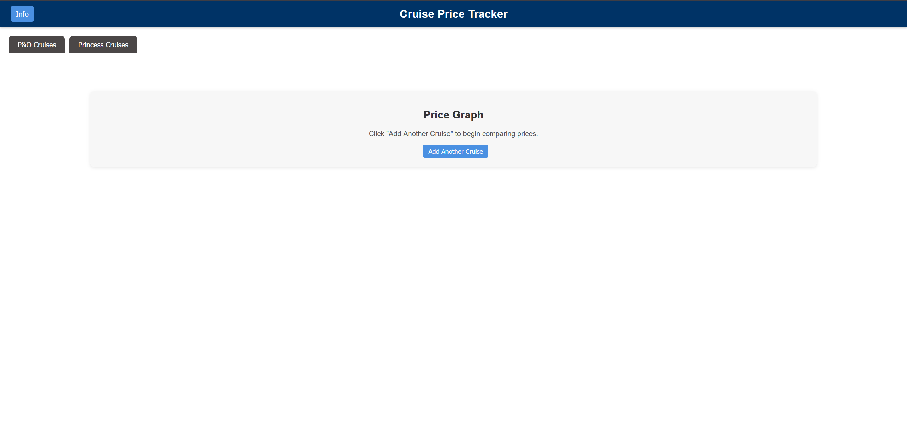
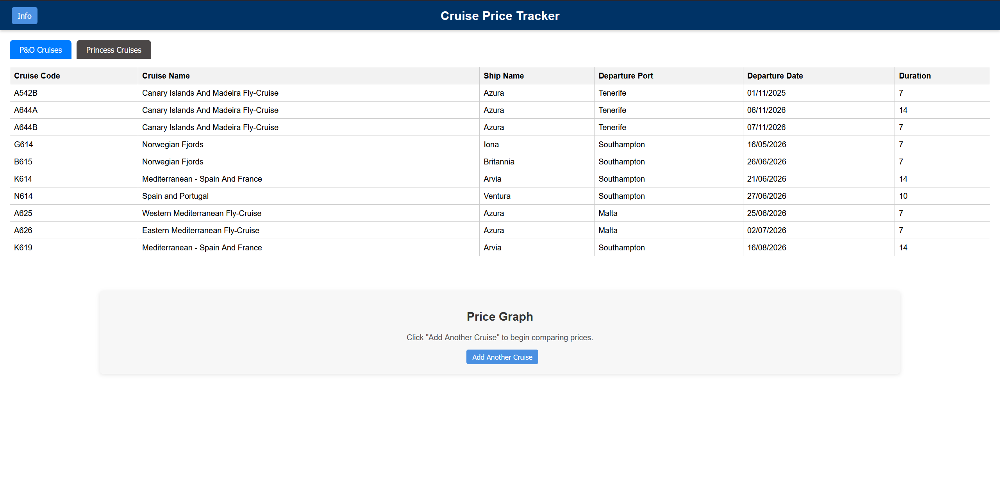
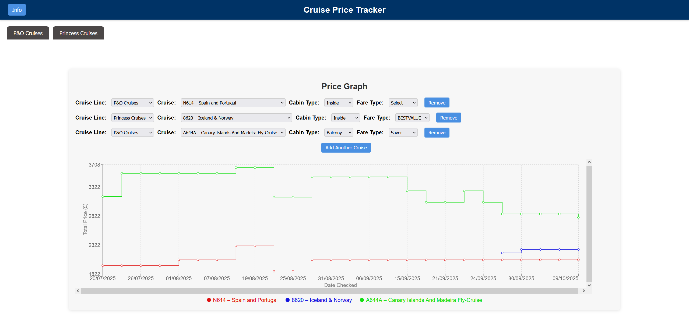

# Cruise Price Tracking Web App
A web app for visualizing and dynamically tracking cruise prices across multiple cruise lines for real-time comparison and insights.

## Description
A web application that allows users to track prices of pre-selected cruises, view them in a dynamic table, and explore historical trends through interactive graphs. Built with a React frontend and a Python/Flask backend.

## Features
- View currently tracked cruises in a table
- Display historical price trends on a line graph
- Add and remove cruises from the graph dynamically to compare

## How the Data is Collected
- The app fetches cruise pricing and cabin information for selected Cruises using Python scripts (`[cruise company]_price_tracker.py`).  
- The script requests data from the cruise's public API endpoints for a set of predefined cruise codes and cabin types.  
- Data includes:
  - Cruise name and ship
  - Departure port and date
  - Duration
  - Cabin type
  - Pricing for different fare types, onboard credits, and drinks packages  

- The script inserts this data into a local SQLite database (`cruises.db`).  
- **Updates Schedule:** The script is automatically executed via **GitHub Actions** **every day** at **9:00 AM UK** time.  

## Screenshots
### Main Dashboard

### Cruise List

### Price Graph

## Technologies Used
- Frontend: React, Chart.js
- Backend: Python, Flask, SQLite
- Styling: CSS

## Access the WebApp
Open your browser and go to: https://cruise-price-tracking-web-app.vercel.app/ to view the Web App

## Disclaimer
- Data is provided for informational purposes only.
- This project is provided for **educational and personal use only**.
- This app currently only tracks **P&O Cruises** and **Princess Cruises** for personal reasons.    
- This project is **not affiliated with or endorsed** by P&O Cruises, Princess Cruises or any other cruise company.  
- Users should **always check the official Cruise website** before making any booking or travel decisions.
